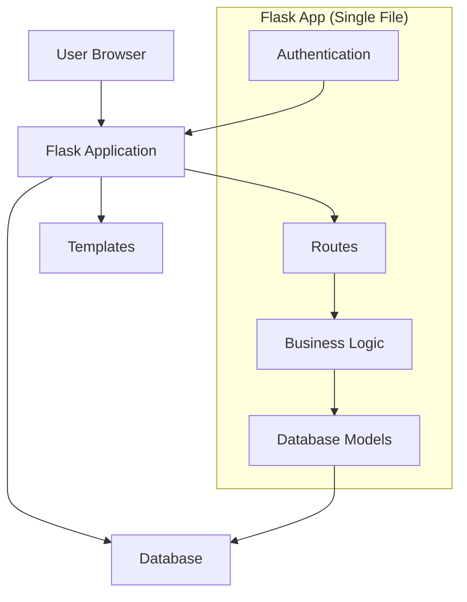
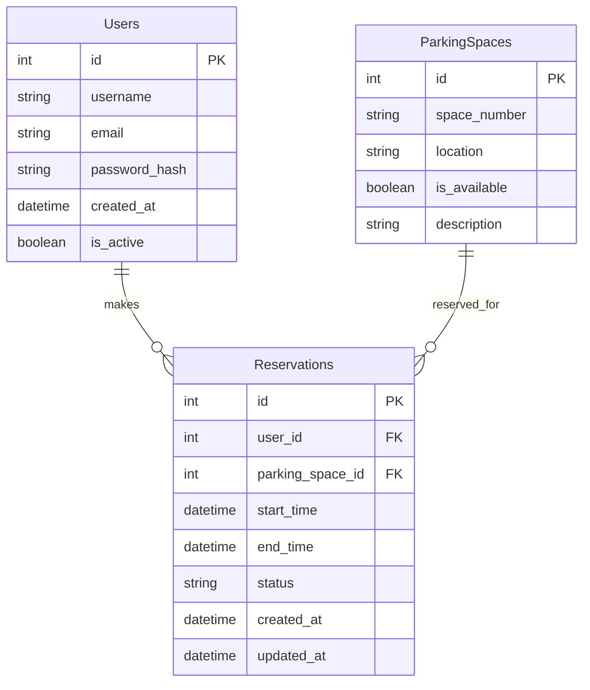
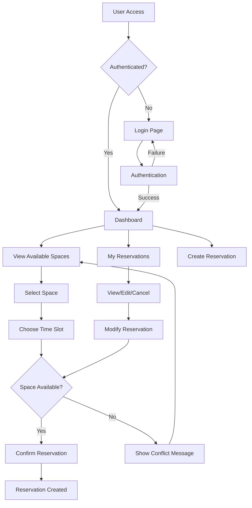

# About - Carpool Parking Reservation System

## Overview

This is a Flask-based web application designed for managing parking place reservations in a carpool system. The application provides a simple GUI for users to view available parking spaces, create reservations, and manage their bookings while preventing double-booking conflicts.

## Implementation Details

### Technology Stack

- **Backend Framework**: Flask (Python web framework)
- **Frontend**: HTML templates with Flask-Admin (optional)
- **Database**: SQLite/PostgreSQL (to be determined)
- **Authentication**: Flask-Login (simple authentication system)
- **Styling**: Bootstrap CSS framework

### Current Architecture

The application currently follows a monolithic architecture with all logic contained in a single file. This approach has several limitations that need to be addressed during the refactoring process.

#### System Architecture

#### Database Schema (Planned)

#### User Flow Diagram

### Key Features

1. **Parking Space Management**
   - List all available parking spaces
   - Display space details and availability status
   - Real-time availability updates

2. **Reservation System**
   - Create new reservations with date/time selection
   - Update existing reservations
   - Cancel reservations
   - Prevent double-booking through validation

3. **User Authentication** (Optional)
   - User registration and login
   - Session management
   - Basic user roles and permissions

4. **Conflict Prevention**
   - Time slot validation
   - Overlapping reservation detection
   - Automatic availability updates

## Current State Analysis

### Identified Issues

The current codebase (when implemented) will have several critical issues that need to be addressed:

1. **Code Structure Problems**
   - Monolithic design with all logic in one file
   - No separation of concerns
   - Lack of proper blueprints and modular design

2. **Code Quality Issues**
   - Poor variable and function naming conventions
   - Repeated code blocks
   - Mixed presentation and business logic

3. **Security Concerns**
   - No input validation
   - Minimal error handling
   - Potential SQL injection vulnerabilities
   - No CSRF protection

4. **Maintainability Issues**
   - Outdated Flask patterns
   - No unit tests
   - Poor error handling
   - Lack of documentation

## TODO List - Improvements Required

### Phase 1: Foundation and Structure
- [ ] **Project Structure Refactoring**
  - [ ] Create proper package structure with blueprints
  - [ ] Separate models, views, and controllers
  - [ ] Implement proper configuration management
  - [ ] Add environment-specific settings

- [ ] **Code Quality Improvements**
  - [ ] Rename variables and functions to follow conventions
  - [ ] Remove code duplication
  - [ ] Implement proper error handling
  - [ ] Add comprehensive logging

### Phase 2: Security and Validation
- [ ] **Input Validation**
  - [ ] Implement form validation using Flask-WTF
  - [ ] Add server-side validation for all inputs
  - [ ] Sanitize user inputs to prevent XSS
  - [ ] Validate date/time inputs and ranges

- [ ] **Security Enhancements**
  - [ ] Implement CSRF protection
  - [ ] Add proper authentication and authorization
  - [ ] Use parameterized queries to prevent SQL injection
  - [ ] Implement proper session management
  - [ ] Add rate limiting for API endpoints

### Phase 3: Database and Models
- [ ] **Database Design**
  - [ ] Design proper database schema
  - [ ] Implement database migrations
  - [ ] Add proper indexing for performance
  - [ ] Implement soft deletes for reservations

- [ ] **Model Improvements**
  - [ ] Create proper ORM models using SQLAlchemy
  - [ ] Add model validations and constraints
  - [ ] Implement proper relationships
  - [ ] Add audit trails for changes

### Phase 4: Business Logic
- [ ] **Reservation Logic**
  - [ ] Implement robust double-booking prevention
  - [ ] Add reservation expiration handling
  - [ ] Create reservation status management
  - [ ] Add email notifications for reservations

- [ ] **Conflict Resolution**
  - [ ] Implement time slot conflict detection
  - [ ] Add reservation modification workflows
  - [ ] Create waitlist functionality
  - [ ] Add recurring reservation support

### Phase 5: User Interface
- [ ] **Frontend Improvements**
  - [ ] Create responsive design
  - [ ] Implement proper form handling
  - [ ] Add AJAX for dynamic updates
  - [ ] Improve user experience with better error messages

- [ ] **Admin Interface**
  - [ ] Create admin dashboard
  - [ ] Add user management capabilities
  - [ ] Implement parking space management
  - [ ] Add reporting and analytics

### Phase 6: Testing and Quality Assurance
- [ ] **Test Implementation**
  - [ ] Create unit tests for all models
  - [ ] Add integration tests for API endpoints
  - [ ] Implement functional tests for user workflows
  - [ ] Add performance tests for database queries

- [ ] **Code Quality Tools**
  - [ ] Set up linting with flake8/black
  - [ ] Add code coverage reporting
  - [ ] Implement pre-commit hooks
  - [ ] Add continuous integration pipeline

### Phase 7: Performance and Scalability
- [ ] **Performance Optimization**
  - [ ] Implement database query optimization
  - [ ] Add caching for frequently accessed data
  - [ ] Optimize static asset delivery
  - [ ] Implement proper database connection pooling

- [ ] **Scalability Considerations**
  - [ ] Design for horizontal scaling
  - [ ] Implement proper error monitoring
  - [ ] Add health check endpoints
  - [ ] Plan for load balancing

### Phase 8: Documentation and Deployment
- [ ] **Documentation**
  - [ ] Create comprehensive API documentation
  - [ ] Add user manual and guides
  - [ ] Document deployment procedures
  - [ ] Create troubleshooting guides

- [ ] **Deployment**
  - [ ] Set up production-ready configuration
  - [ ] Implement proper logging and monitoring
  - [ ] Create backup and recovery procedures
  - [ ] Add environment-specific deployments

## Development Guidelines

### Coding Standards
- Follow PEP 8 style guidelines
- Use meaningful variable and function names
- Implement proper error handling and logging
- Write comprehensive docstrings and comments
- Maintain consistent code formatting

### Testing Strategy
- Write tests before implementing features (TDD approach)
- Maintain high code coverage (>80%)
- Include both positive and negative test cases
- Test edge cases and error conditions

### Security Best Practices
- Validate all user inputs
- Use parameterized queries
- Implement proper authentication and authorization
- Keep dependencies updated
- Regular security audits

## Getting Started

Once the initial implementation is complete, developers can:

1. Clone the repository
2. Set up a virtual environment
3. Install dependencies from `requirements.txt`
4. Configure database settings
5. Run database migrations
6. Start the development server
7. Access the application at `http://localhost:5000`

## Contributing

This project serves as a learning exercise for Flask development and code refactoring. Contributors should focus on:

- Following the refactoring plan outlined in this document
- Making incremental improvements
- Adding comprehensive tests
- Maintaining backward compatibility where possible
- Documenting all changes and decisions

## License

[To be determined based on project requirements]