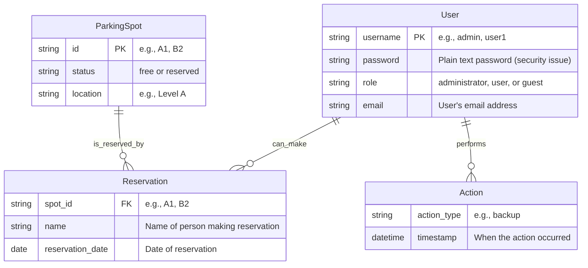

# Parkovací rezervační systém

## O projektu
Tento projekt je jednoduchý rezervační systém pro parkovací místa implementovaný v Pythonu s využitím frameworku Flask. Aplikace byla záměrně vytvořena s mnoha špatnými programovacími praktikami jako cvičení pro refaktoring a zlepšení kódu.

## Struktura projektu

### Hlavní aplikační soubory
- [app.py](app.py) - Obsahuje Flask aplikaci, routy a většinu aplikační logiky
- [run.py](run.py) - Vstupní bod aplikace, který spouští webový server

### Pomocné soubory
- [utils.py](utils.py) - Pomocné funkce a globální konfigurace
- [config.py](config.py) - Konfigurační soubor (nepoužívaný správně)

### Datové soubory
- [data.json](data.json) - Hlavní úložiště dat pro rezervace
- [backup.json](backup.json) - Záloha dat rezervací
- [users.json](users.json) - Uživatelské účty
- [parking_config.json](parking_config.json) - Konfigurace parkovacích míst
- [actions.json](actions.json) - Log akcí v JSON formátu

### Ostatní soubory
- [log.txt](log.txt) - Jednoduchý textový log aplikace
- [requirements.txt](requirements.txt) - Seznam závislostí projektu
- [README.md](README.md) - Dokumentace projektu a zadání cvičení

## Funkcionalita
Aplikace umožňuje:
- Přihlášení uživatelů
- Zobrazení seznamu parkovacích míst
- Rezervaci parkovacího místa
- Zrušení rezervace
- Administrátorské funkce

## Datový model

Diagram níže znázorňuje strukturu databáze v JSON souborech:

Hlavní entity v aplikaci:
- **ParkingSpot** - Parkovací místa definovaná v `parking_config.json`
- **Reservation** - Rezervace uložené v `data.json` s parkovacím místem jako klíčem
- **User** - Uživatelské účty definované v `users.json`
- **Action** - Systémové akce zaznamenané v `actions.json`

## Problémy projektu
Projekt obsahuje záměrně mnoho špatných praktik, například:
- Veškerá logika v jednom souboru
- Špatné pojmenování proměnných a funkcí
- Míchání logiky a prezentace (HTML v Python kódu)
- Chybějící validace vstupů
- Nedostatečné ošetření chyb
- Bezpečnostní problémy (pevně zakódovaná hesla)
- Nekonzistentní ukládání dat
- Opakující se kód
- Žádné testy

## Cíl projektu
Projekt slouží jako praktické cvičení pro refaktoring a zlepšení kódu s využitím GitHub Copilot. Cílem je identifikovat problémy v kódu a postupně je řešit podle nejlepších praktik vývoje v Pythonu a Flasku.