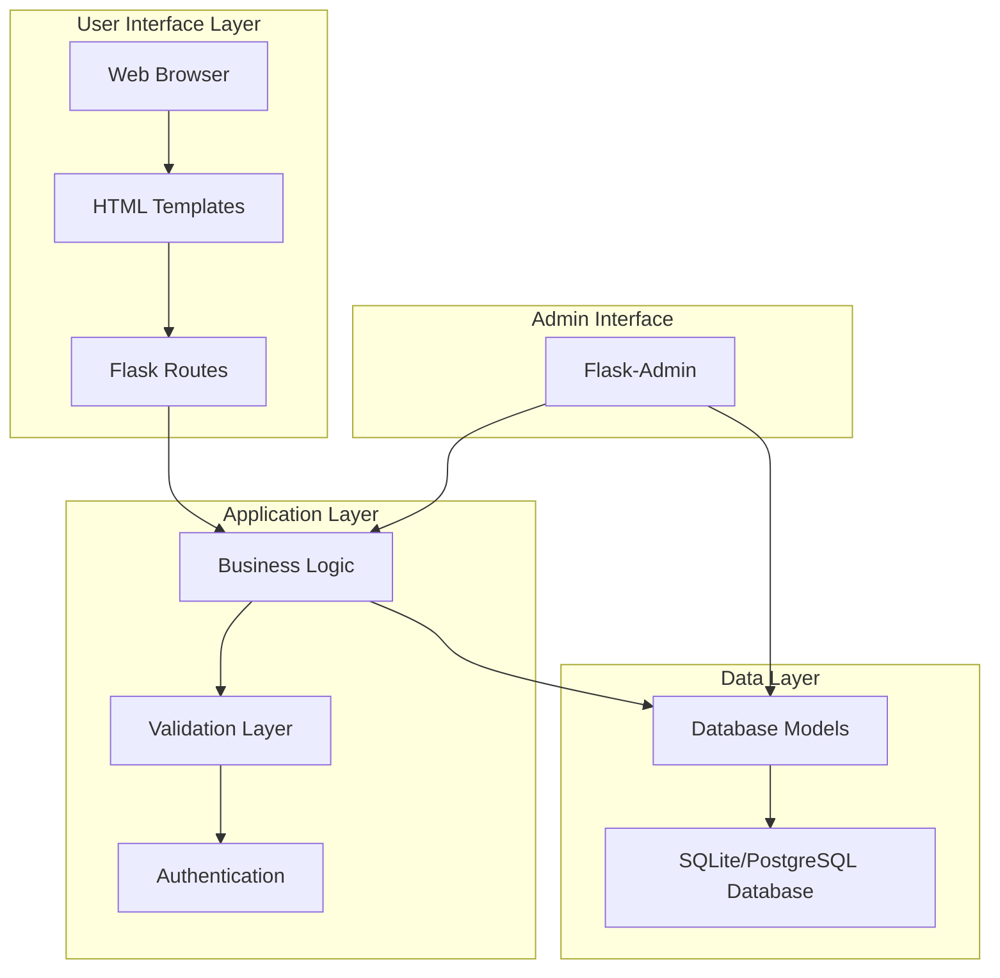
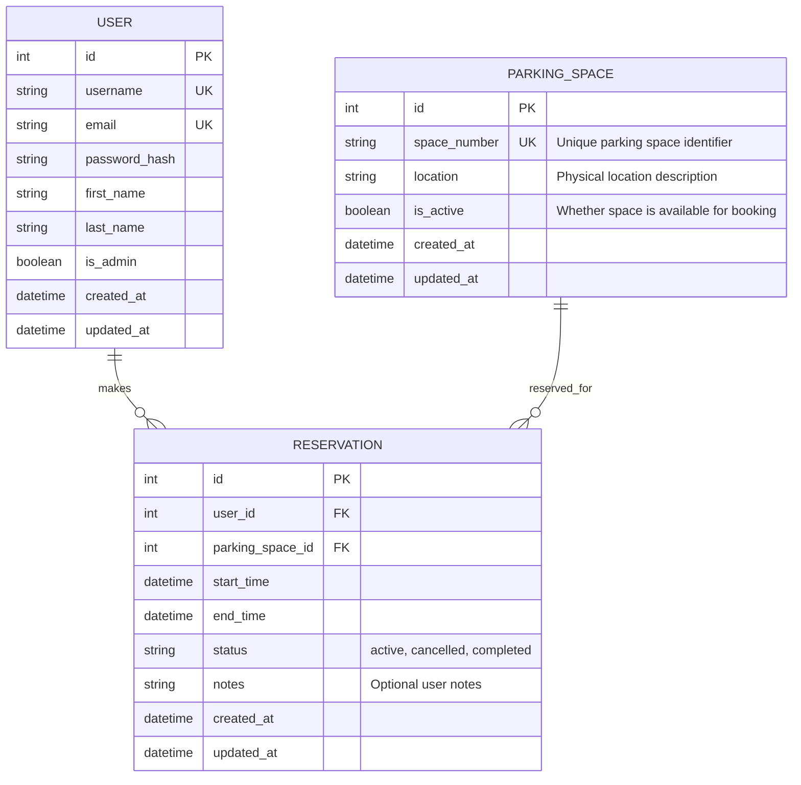
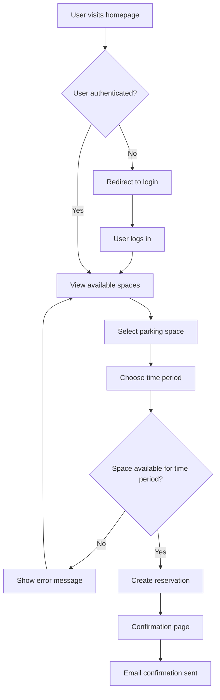
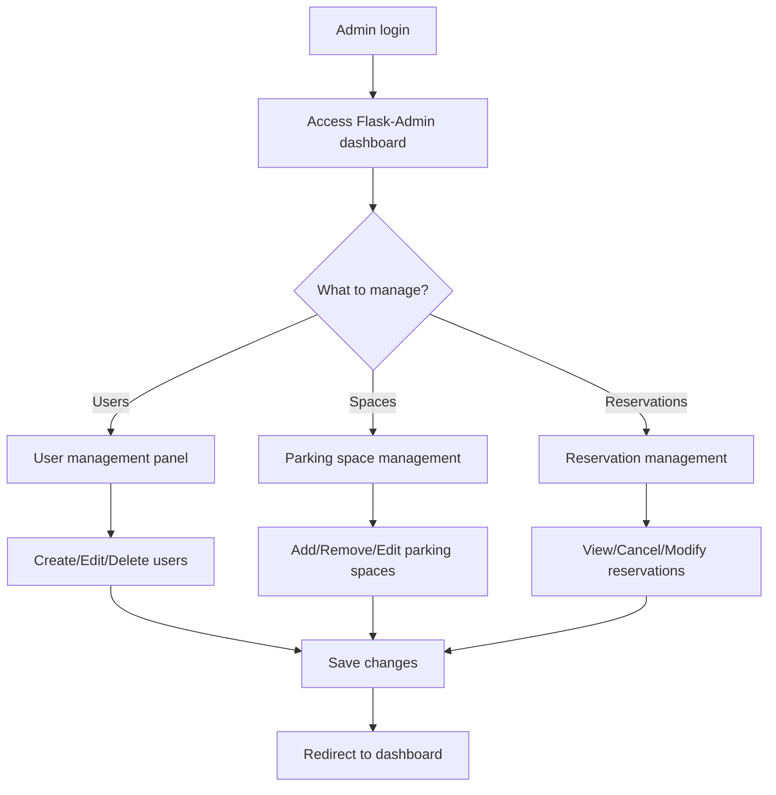

# About the Parking Reservation System

## Overview
This is a Flask-based web application designed for managing parking place reservations. The system allows users to view available parking spaces, create reservations, and manage bookings while preventing double-booking conflicts.

## Implementation Details

### Technology Stack
- **Backend Framework**: Flask (Python web framework)
- **Frontend**: HTML templates with Flask templating engine
- **Database**: SQLite (for development) / PostgreSQL (for production)
- **Authentication**: Flask-Login (optional feature)
- **Admin Interface**: Flask-Admin (for administrative tasks)

### Core Features

#### 1. Parking Space Management
- **Listing Available Spaces**: Display all parking spaces with their current availability status
- **Space Details**: Each parking space has a unique identifier and status (available/reserved)
- **Real-time Updates**: Availability status updates in real-time when reservations are made or cancelled

#### 2. Reservation System
- **Create Reservations**: Users can book available parking spaces for specific time periods
- **Update Reservations**: Modify existing reservations (time, space, etc.)
- **Cancel Reservations**: Remove reservations and free up parking spaces
- **Double-booking Prevention**: System validates that a space is not already reserved for the requested time period

#### 3. User Authentication (Optional)
- **User Registration**: New users can create accounts
- **Login/Logout**: Secure authentication system
- **Session Management**: Maintain user sessions for better UX
- **Role-based Access**: Different permissions for regular users vs administrators

### System Architecture



### Database Schema



### User Flow Diagrams

#### Reservation Creation Flow


#### Admin Management Flow


### API Endpoints Structure

| Method | Endpoint | Description |
|--------|----------|-------------|
| GET | `/` | Homepage with available spaces |
| GET | `/spaces` | List all parking spaces |
| GET | `/spaces/<id>` | View specific parking space |
| POST | `/reservations` | Create new reservation |
| GET | `/reservations` | List user's reservations |
| PUT | `/reservations/<id>` | Update existing reservation |
| DELETE | `/reservations/<id>` | Cancel reservation |
| GET | `/login` | Login page |
| POST | `/login` | Process login |
| GET | `/logout` | Logout user |
| GET | `/register` | Registration page |
| POST | `/register` | Process registration |

## Current State
**Note**: This repository currently contains only documentation. The actual Flask application implementation is pending and will be developed as part of the refactoring exercise described in README.md.

## TODO List - Improvements Needed

### 🏗️ **Code Structure & Architecture**
- [ ] Create proper Flask application structure with blueprints
- [ ] Implement Model-View-Controller (MVC) pattern
- [ ] Separate business logic from presentation layer
- [ ] Create dedicated modules for different functionalities
- [ ] Implement proper package structure with `__init__.py` files
- [ ] Set up configuration management (development/production configs)

### 🔧 **Code Quality Issues**
- [ ] **Variable & Function Naming**
  - [ ] Replace unclear variable names with descriptive ones
  - [ ] Use consistent naming conventions (snake_case for Python)
  - [ ] Add meaningful docstrings to all functions and classes
  
- [ ] **Code Organization**
  - [ ] Break down large functions into smaller, focused functions
  - [ ] Remove code duplication and create reusable functions
  - [ ] Implement proper error handling throughout the application
  - [ ] Add comprehensive logging system

### 🛡️ **Security Improvements**
- [ ] **Input Validation**
  - [ ] Implement server-side validation for all forms
  - [ ] Add CSRF protection to forms
  - [ ] Sanitize user inputs to prevent XSS attacks
  - [ ] Validate date/time inputs for reservations
  
- [ ] **Authentication & Authorization**
  - [ ] Implement secure password hashing (bcrypt/scrypt)
  - [ ] Add session security (secure cookies, session timeout)
  - [ ] Implement role-based access control
  - [ ] Add rate limiting for login attempts

### 🗄️ **Database & Data Management**
- [ ] **Database Schema**
  - [ ] Design proper database schema with relationships
  - [ ] Implement database migrations system (Flask-Migrate)
  - [ ] Add proper indexes for performance
  - [ ] Implement soft deletes for audit trail
  
- [ ] **Data Validation**
  - [ ] Add database-level constraints
  - [ ] Implement business rule validations
  - [ ] Add data integrity checks for reservations
  - [ ] Prevent double-booking at database level

### 🎨 **User Interface & Experience**
- [ ] **Frontend Improvements**
  - [ ] Create responsive design for mobile devices
  - [ ] Implement modern CSS framework (Bootstrap/Tailwind)
  - [ ] Add JavaScript for better user interactions
  - [ ] Implement real-time updates (WebSocket/AJAX)
  - [ ] Add loading indicators and better error messages
  
- [ ] **Accessibility**
  - [ ] Add proper ARIA labels and semantic HTML
  - [ ] Ensure keyboard navigation support
  - [ ] Implement proper color contrast
  - [ ] Add screen reader support

### 🧪 **Testing Strategy**
- [ ] **Unit Tests**
  - [ ] Test all business logic functions
  - [ ] Test database models and relationships
  - [ ] Test validation functions
  - [ ] Achieve minimum 80% code coverage
  
- [ ] **Integration Tests**
  - [ ] Test complete user workflows
  - [ ] Test API endpoints
  - [ ] Test authentication flows
  - [ ] Test double-booking prevention
  
- [ ] **End-to-End Tests**
  - [ ] Test complete user journeys in browser
  - [ ] Test admin functionality
  - [ ] Test error scenarios and edge cases

### 📊 **Performance & Monitoring**
- [ ] **Performance Optimization**
  - [ ] Implement database query optimization
  - [ ] Add caching layer (Redis/Memcached)
  - [ ] Optimize static file serving
  - [ ] Implement pagination for large datasets
  
- [ ] **Monitoring & Logging**
  - [ ] Set up application logging
  - [ ] Implement error tracking (Sentry)
  - [ ] Add performance monitoring
  - [ ] Create health check endpoints

### 🚀 **DevOps & Deployment**
- [ ] **Development Environment**
  - [ ] Create Docker containerization
  - [ ] Set up development database seeding
  - [ ] Implement environment variable management
  - [ ] Add pre-commit hooks for code quality
  
- [ ] **Production Readiness**
  - [ ] Set up production configuration
  - [ ] Implement proper SSL/TLS configuration
  - [ ] Add database backup strategy
  - [ ] Create deployment pipeline (CI/CD)

### 📚 **Documentation**
- [ ] **Code Documentation**
  - [ ] Add comprehensive README with setup instructions
  - [ ] Document all API endpoints
  - [ ] Create development guidelines
  - [ ] Add architectural decision records (ADRs)
  
- [ ] **User Documentation**
  - [ ] Create user manual
  - [ ] Add admin guide
  - [ ] Document troubleshooting steps
  - [ ] Create FAQ section

### 🔄 **Maintenance & Updates**
- [ ] **Dependency Management**
  - [ ] Keep dependencies updated
  - [ ] Remove unused dependencies
  - [ ] Add security vulnerability scanning
  - [ ] Implement automated dependency updates

---

## Getting Started (Future Implementation)
Once the Flask application is implemented, follow these steps:

1. **Clone the repository**
   ```bash
   git clone https://github.com/spazyCZ/rbcz_gh-copilot-basic_carpool_messy_1.git
   cd rbcz_gh-copilot-basic_carpool_messy_1
   ```

2. **Set up virtual environment**
   ```bash
   python -m venv venv
   source venv/bin/activate  # On Windows: venv\Scripts\activate
   ```

3. **Install dependencies**
   ```bash
   pip install -r requirements.txt
   ```

4. **Initialize database**
   ```bash
   flask db init
   flask db migrate -m "Initial migration"
   flask db upgrade
   ```

5. **Run the application**
   ```bash
   flask run
   ```

## Contributing
This project is designed as a learning exercise for Flask development with GitHub Copilot. Contributors should focus on implementing clean, well-structured code following Python and Flask best practices.

## License
[To be defined based on project requirements]