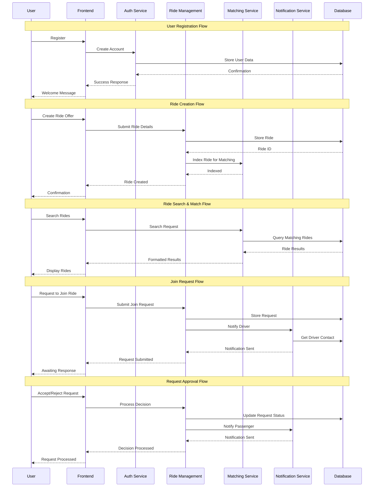

# Component Interaction Diagram

## Interaction Notes

- **Authentication**: Centralized user authentication and session management
- **Ride Management**: Handles all ride-related operations and business logic
- **Matching Service**: Optimized search and matching algorithms
- **Notification Service**: Asynchronous notification delivery
- **Database**: Persistent storage with transactional integrity
