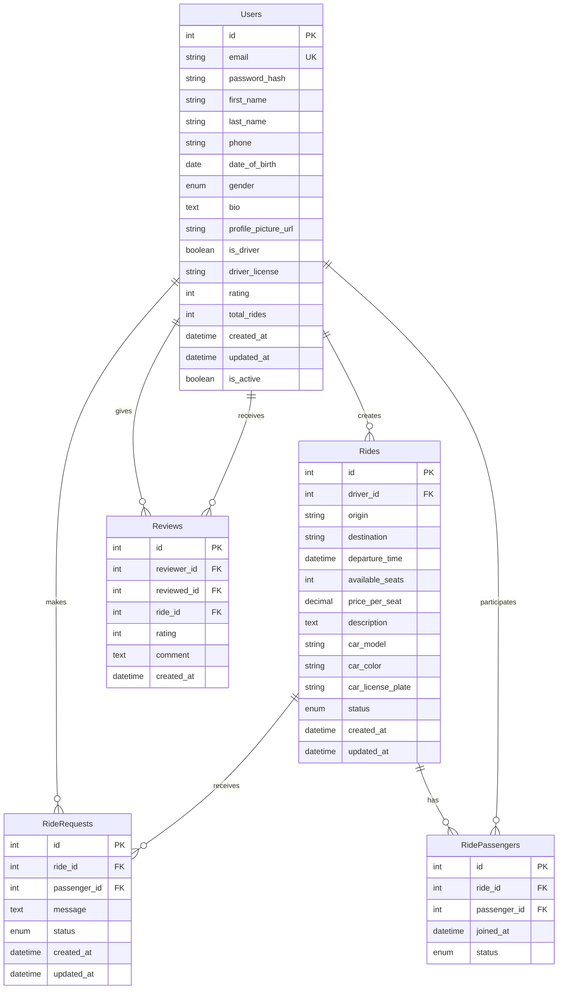

# Database Schema Diagram

## Schema Notes

- **Users**: Core user information including driver capabilities
- **Rides**: Ride offers with details about route, timing, and capacity
- **RideRequests**: Passenger requests to join specific rides
- **RidePassengers**: Confirmed passengers for rides
- **Reviews**: User ratings and feedback system
