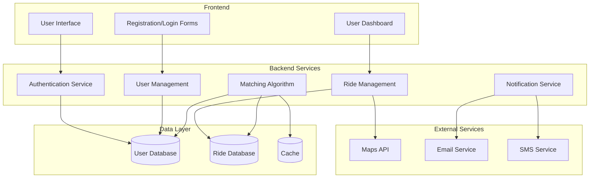

# System Architecture Diagram

## Component Descriptions

- **Frontend**: User-facing interface for registration, login, and ride management
- **Authentication Service**: Handles user authentication and authorization
- **User Management**: Manages user profiles and preferences
- **Ride Management**: Handles ride creation, updates, and cancellations
- **Matching Algorithm**: Finds compatible rides and passengers
- **Notification Service**: Sends notifications via email and SMS
- **External Services**: Third-party integrations for maps and communications
