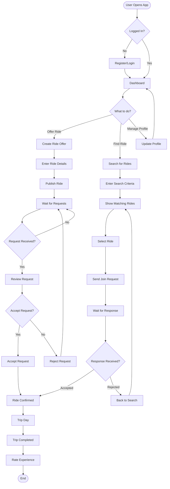

# User Flow Diagram

```mermaid
flowchart TD
    Start([User Opens App]) --> Login{Logged In?}
    Login -->|No| Register[Register/Login]
    Login -->|Yes| Dashboard[Dashboard]
    Register --> Dashboard
    
    Dashboard --> Action{What to do?}
    Action -->|Offer Ride| OfferRide[Create Ride Offer]
    Action -->|Find Ride| FindRide[Search for Rides]
    Action -->|Manage Profile| Profile[Update Profile]
    
    OfferRide --> RideDetails[Enter Ride Details]
    RideDetails --> PublishRide[Publish Ride]
    PublishRide --> WaitRequests[Wait for Requests]
    
    FindRide --> SearchCriteria[Enter Search Criteria]
    SearchCriteria --> ShowResults[Show Matching Rides]
    ShowResults --> SelectRide[Select Ride]
    SelectRide --> SendRequest[Send Join Request]
    
    WaitRequests --> RequestReceived{Request Received?}
    RequestReceived -->|Yes| ReviewRequest[Review Request]
    RequestReceived -->|No| WaitRequests
    
    ReviewRequest --> Decision{Accept Request?}
    Decision -->|Yes| AcceptRequest[Accept Request]
    Decision -->|No| RejectRequest[Reject Request]
    
    SendRequest --> WaitResponse[Wait for Response]
    WaitResponse --> Response{Response Received?}
    Response -->|Accepted| RideConfirmed[Ride Confirmed]
    Response -->|Rejected| BackToSearch[Back to Search]
    
    AcceptRequest --> RideConfirmed
    RideConfirmed --> TripDay[Trip Day]
    TripDay --> Complete[Trip Completed]
    Complete --> Rating[Rate Experience]
    Rating --> End([End])
    
    RejectRequest --> WaitRequests
    BackToSearch --> ShowResults
    Profile --> Dashboard
```
